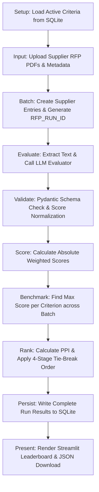

# 🏆 Agentic RFP Evaluation and Supplier Ranking System

An AI-assisted procurement application that reads supplier RFP proposals (PDFs), scores them against active criteria using an LLM (with evidence grounding), validates output schemas using Pydantic, and applies 100% deterministic scoring, peer benchmarking (PPI), and stable 4-stage tie-breaker ranking.

---

## 🏗️ System Architecture & Data Flow



---

## 🤖 Agentic Component Responsibilities

| Component | Responsibility | Tooling Used |
| :--- | :--- | :--- |
| **Orchestrator Agent** | Controls workflow, fetches criteria, calls tools in order, records warnings, and saves run. | Python (`orchestrator.py`) |
| **Document Tool** | Extracts clean text from uploaded supplier RFP PDFs. | PyMuPDF (`fitz`) / `pypdf` (`pdf_extractor.py`) |
| **Evaluation Agent** | Evaluates proposal against active criteria, returning structured JSON with evidence quotes & justifications. | Gemini / OpenAI API with Mock Fallback (`evaluator.py`) |
| **Validation Tool** | Checks schema, fills missing criteria with default fill-ins, clips out-of-range scores, and logs warnings. | Pydantic (`validator.py`) |
| **Ranking Tool** | Performs formulas, peer benchmarking, gap calculation, PPI, and 4-tier tie-breaker ranking. | Deterministic Python only (`ranker.py`) |

> **Important Boundary Rule:** The LLM judges proposal content and cites evidence, but **never** decides final arithmetic, benchmarks, tie-breaks, or sequential ranks.

---

## 📊 Deterministic Formulas

1. **Absolute Weighted Score**:
   $$\text{Absolute Score} = \sum_{c \in \text{Active}} \left( \frac{\text{Score}_c}{\text{Max Score}_c} \right) \times \text{Weight}_c$$

2. **Criterion Benchmark**:
   $$\text{Benchmark}_c = \max_{s \in \text{Batch}} (\text{Score}_{s, c})$$

3. **Criterion Gap**:
   $$\text{Gap}_{s, c} = \text{Score}_{s, c} - \text{Benchmark}_c \quad (\le 0)$$

4. **Relative Performance %**:
   $$\text{Relative \%}_{s, c} = \left( \frac{\text{Score}_{s, c}}{\text{Benchmark}_c} \right) \times 100$$

5. **Peer Performance Index (PPI)**:
   $$\text{PPI}_s = \sum_{c \in \text{Active}} \text{Relative \%}_{s, c} \times \left( \frac{\text{Weight}_c}{\sum \text{Weight}} \right)$$

---

## ⚖️ Mandatory Tie-Break Order

Sorting key applied sequentially ($1, 2, 3, 4 \dots$):
1. **Higher PPI first** ($-\text{PPI}$)
2. **Earlier submission date** ($\text{submission\_date}$ ascending)
3. **Higher historical experience rating** ($-\text{experience\_rating}$)
4. **Supplier name ascending** ($\text{supplier\_name}$ alphabetical)

---

## 🗄️ SQLite Database Schema

- `evaluation_criteria`: `criterion_id`, `name`, `description`, `weight`, `max_score`, `is_active`
- `rfp_runs`: `rfp_run_id`, `created_at`, `status`
- `supplier_results`: `id`, `rfp_run_id`, `supplier_name`, `submission_date`, `experience_rating`, `absolute_score`, `ppi`, `final_rank`, `result_json`

---

## 💻 Running in Google Colab & Locally

### Google Colab
1. Upload `agentic_rfp_evaluation_colab.ipynb` to Google Colab.
2. Run cells sequentially:
   - Cell 1: Install dependencies (`streamlit`, `pymupdf`, `pydantic`, `reportlab`, `google-genai`, `openai`).
   - Cell 2-4: Initialize database and generate 4 synthetic supplier PDFs.
   - Cell 5: Run full batch evaluation end-to-end directly in notebook cell.
   - Cell 6: Launch Streamlit web dashboard via `localtunnel`.

### Local Execution
```bash
pip install -r requirements.txt
python pdf_generator.py
streamlit run app.py
```

---

## 🏆 Benchmark Leaderboard Results (4 Synthetic Suppliers)

| Rank | Supplier | Absolute Score (100) | PPI (%) | Submission Date | Experience Rating |
| :---: | :--- | :---: | :---: | :---: | :---: |
| **#1** | **NexaWorks** | **88.00** | **92.78%** | 2026-07-28 | 4.5 / 5.0 |
| **#2** | **Apex Systems** | **79.00** | **83.74%** | 2026-08-01 | 4.8 / 5.0 |
| **#3** | **Orbit Digital** | **69.50** | **73.04%** | 2026-08-05 | 5.0 / 5.0 |
| **#4** | **BrightPath Tech** | **68.00** | **71.37%** | 2026-07-15 | 2.0 / 5.0 |
